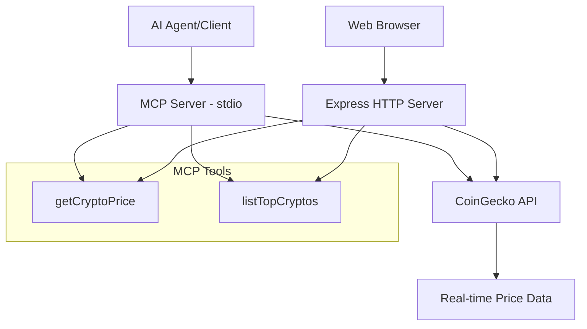

# 🚀 RealTime CryptoPrice MCP Server

A comprehensive **Model Context Protocol (MCP)** server implementation that provides real-time cryptocurrency price data from CoinGecko API. This project demonstrates both traditional MCP stdio transport and modern HTTP endpoints for enhanced testing and integration capabilities.


## 📋 Table of Contents

- [🎯 Overview](#-overview)
- [✨ Features](#-features)
- [🏗️ Architecture](#️-architecture)
- [🚀 Quick Start](#-quick-start)
- [📖 Step-by-Step Tutorial](#-step-by-step-tutorial)
- [🔧 Usage](#-usage)
- [📡 API Endpoints](#-api-endpoints)
- [🛠️ Development](#️-development)
- [🧪 Testing](#-testing)
- [🚀 Deployment](#-deployment)
- [🤝 Contributing](#-contributing)
- [📄 License](#-license)

## 🎯 Overview

This project implements a **Model Context Protocol (MCP)** server that serves as a bridge between AI agents and real-time cryptocurrency market data. It provides:

- **Standard MCP Interface**: Compatible with any MCP-compliant client
- **HTTP Web Dashboard**: Beautiful, responsive interface for testing and monitoring
- **Real-time Data**: Live cryptocurrency prices from CoinGecko API
- **Dual Transport**: Both stdio (standard MCP) and HTTP endpoints

### What is MCP?

Model Context Protocol (MCP) is a standardized protocol that enables AI agents to access external data sources and tools in a secure, consistent manner. This server exposes cryptocurrency market data through MCP tools that AI agents can invoke.

## ✨ Features

### 🔥 Core Features
- **Real-time Price Data**: Live cryptocurrency prices and market data
- **Multiple Cryptocurrencies**: Support for Bitcoin, Ethereum, and 1000+ coins
- **Currency Flexibility**: Prices in USD, EUR, JPY, GBP, CAD, AUD
- **Top Crypto Rankings**: Market cap-based cryptocurrency listings
- **Clean API Design**: RESTful endpoints with JSON responses

### 🎨 Web Interface Features
- **Responsive Dashboard**: Beautiful, mobile-friendly interface
- **Live Status Monitoring**: Real-time server health checks
- **Interactive Forms**: Easy cryptocurrency price lookups
- **Market Overview**: Top cryptocurrencies with 24h changes
- **Error Handling**: Graceful error messages and loading states

### 🔧 Technical Features
- **MCP Protocol**: Standard stdio transport for AI agent integration
- **Express.js Server**: HTTP endpoints for web interface and API access
- **TypeScript Support**: Full type definitions and validation with Zod
- **Error Resilience**: Comprehensive error handling and recovery
- **Production Ready**: Optimized for deployment and scaling

## 🏗️ Architecture



### Component Architecture

1. **Protocol Layer**: MCP stdio transport for AI agent communication
2. **Service Layer**: Business logic for cryptocurrency data processing
3. **Data Layer**: CoinGecko API integration and caching
4. **Presentation Layer**: HTTP server with web dashboard

## 🚀 Quick Start

### Prerequisites
- Node.js 18+ installed
- Git installed
- Terminal/Command prompt access

### Installation

```bash
# Clone the repository
git clone https://github.com/AdI-70/realtime-cryptoprice-MCP.git
cd realtime-cryptoprice-MCP

# Install dependencies
npm install

# Start the web server
npm run web
```

Open http://localhost:3000 in your browser to see the dashboard!

### Test MCP Server

```bash
# In a separate terminal, test the MCP client
npm run client
```

## 📖 Step-by-Step Tutorial: Building from Scratch

### Step 1: Project Setup

1. **Create Project Directory**
   ```bash
   mkdir crypto-mcp-server
   cd crypto-mcp-server
   ```

2. **Initialize Node.js Project**
   ```bash
   npm init -y
   ```

3. **Configure ES Modules**
   ```json
   // Add to package.json
   {
     "type": "module",
     "scripts": {
       "start": "node server.js",
       "client": "node client.js",
       "web": "node web-server.js"
     }
   }
   ```

### Step 2: Install Dependencies

```bash
# Core MCP dependencies
npm install @modelcontextprotocol/sdk zod node-fetch

# Web server dependencies
npm install express
```

### Step 3: Create MCP Server (`server.js`)

```javascript
import { McpServer } from "@modelcontextprotocol/sdk/server/mcp.js";
import { StdioServerTransport } from "@modelcontextprotocol/sdk/server/stdio.js";
import { z } from "zod";
import fetch from "node-fetch";

// Create MCP server instance
const server = new McpServer({
  name: "CryptoPrice",
  version: "1.0.0"
});

// Define getCryptoPrice tool
server.tool("getCryptoPrice", {
  id: z.string().describe("Cryptocurrency ID (e.g., bitcoin, ethereum)"),
  currency: z.string().default("usd").describe("Currency (usd, eur, etc.)")
}, async ({ id, currency }) => {
  try {
    const response = await fetch(
      `https://api.coingecko.com/api/v3/simple/price?ids=${id}&vs_currencies=${currency}`
    );
    const data = await response.json();
    
    if (!data[id]) {
      return { content: [{ type: "text", text: `Cryptocurrency '${id}' not found.` }] };
    }
    
    const price = data[id][currency];
    return {
      content: [{ type: "text", text: `${id}: ${price} ${currency.toUpperCase()}` }]
    };
  } catch (error) {
    return {
      content: [{ type: "text", text: `Error: ${error.message}` }]
    };
  }
});

// Define listTopCryptos tool
server.tool("listTopCryptos", {
  limit: z.number().default(10).describe("Number of top cryptocurrencies")
}, async ({ limit }) => {
  try {
    const response = await fetch(
      `https://api.coingecko.com/api/v3/coins/markets?vs_currency=usd&order=market_cap_desc&per_page=${limit}&page=1`
    );
    const data = await response.json();
    
    const cryptoList = data.map(crypto => 
      `${crypto.name} (${crypto.symbol}): $${crypto.current_price}`
    ).join('\n');
    
    return { content: [{ type: "text", text: cryptoList }] };
  } catch (error) {
    return {
      content: [{ type: "text", text: `Error: ${error.message}` }]
    };
  }
});

// Start server with stdio transport
const transport = new StdioServerTransport();
console.log("Starting CryptoPrice MCP server...");
await server.connect(transport);
console.log("CryptoPrice MCP server running");
```

### Step 4: Create MCP Client (`client.js`)

```javascript
import { Client } from "@modelcontextprotocol/sdk/client/index.js";
import { StdioClientTransport } from "@modelcontextprotocol/sdk/client/stdio.js";

async function main() {
  // Create transport to connect to server
  const transport = new StdioClientTransport({
    command: "node",
    args: ["server.js"]
  });

  // Create client
  const client = new Client({
    name: "crypto-price-client",
    version: "1.0.0"
  });

  // Connect and test
  await client.connect(transport);
  
  try {
    console.log("Connected to CryptoPrice MCP server\n");

    // Test Bitcoin price
    const bitcoinPrice = await client.callTool({
      name: "getCryptoPrice",
      arguments: { id: "bitcoin", currency: "usd" }
    });
    console.log("Bitcoin Price:", bitcoinPrice.content[0].text);

    // Test top cryptocurrencies
    const topCryptos = await client.callTool({
      name: "listTopCryptos",
      arguments: { limit: 5 }
    });
    console.log("\nTop 5 Cryptocurrencies:");
    console.log(topCryptos.content[0].text);
    
  } catch (error) {
    console.error("Error:", error.message);
  }
}

main().catch(console.error);
```

### Step 5: Create Web Server (`web-server.js`)

```javascript
import express from 'express';
import path from 'path';
import { fileURLToPath } from 'url';
import fetch from 'node-fetch';

const __filename = fileURLToPath(import.meta.url);
const __dirname = path.dirname(__filename);
const app = express();
const PORT = 3000;

// Middleware
app.use(express.json());
app.use(express.static('public'));

// API Routes
app.get('/api/crypto/:id', async (req, res) => {
  try {
    const { id } = req.params;
    const { currency = 'usd' } = req.query;
    
    const response = await fetch(
      `https://api.coingecko.com/api/v3/simple/price?ids=${id}&vs_currencies=${currency}`
    );
    const data = await response.json();
    
    if (!data[id]) {
      return res.status(404).json({ error: `Cryptocurrency '${id}' not found` });
    }
    
    res.json({
      id,
      currency: currency.toUpperCase(),
      price: data[id][currency],
      formatted: `${id}: ${data[id][currency]} ${currency.toUpperCase()}`
    });
  } catch (error) {
    res.status(500).json({ error: error.message });
  }
});

app.get('/api/top-cryptos', async (req, res) => {
  try {
    const { limit = 10 } = req.query;
    
    const response = await fetch(
      `https://api.coingecko.com/api/v3/coins/markets?vs_currency=usd&order=market_cap_desc&per_page=${limit}&page=1`
    );
    const data = await response.json();
    
    const cryptoList = data.map(crypto => ({
      id: crypto.id,
      name: crypto.name,
      symbol: crypto.symbol.toUpperCase(),
      price: crypto.current_price,
      change_24h: crypto.price_change_percentage_24h
    }));
    
    res.json({ cryptos: cryptoList, count: cryptoList.length });
  } catch (error) {
    res.status(500).json({ error: error.message });
  }
});

// Health check
app.get('/api/health', (req, res) => {
  res.json({ 
    status: 'healthy', 
    server: 'CryptoPrice MCP Web Server',
    timestamp: new Date().toISOString()
  });
});

app.listen(PORT, () => {
  console.log(`🚀 Server running at http://localhost:${PORT}`);
});
```

### Step 6: Create Web Dashboard

1. **Create public directory**
   ```bash
   mkdir public
   ```

2. **Create `public/index.html`** (Beautiful responsive dashboard)
   - Complete HTML with CSS styling
   - JavaScript for API interactions
   - Real-time updates and error handling

### Step 7: Configure Git

1. **Create `.gitignore`**
   ```
   node_modules/
   *.log
   .env
   .DS_Store
   ```

2. **Initialize Git repository**
   ```bash
   git init
   git add .
   git commit -m "Initial commit: CryptoPrice MCP server"
   ```

### Step 8: Create MCP Configuration

**Create `mcpserver.json`**
```json
{
  "servers": [{
    "name": "CryptoPrice",
    "command": "node",
    "args": ["server.js"],
    "description": "Cryptocurrency price data from CoinGecko",
    "metadata": {
      "version": "1.0.0",
      "tools": [
        {
          "name": "getCryptoPrice",
          "description": "Get current price of a cryptocurrency"
        },
        {
          "name": "listTopCryptos", 
          "description": "List top cryptocurrencies by market cap"
        }
      ]
    }
  }]
}
```

## 🔧 Usage

### MCP Server (stdio transport)
```bash
# Start MCP server
npm start

# Test with client
npm run client
```

### Web Interface
```bash
# Start web server
npm run web

# Open browser
open http://localhost:3000
```

### API Integration
```javascript
// Get Bitcoin price
fetch('http://localhost:3000/api/crypto/bitcoin')
  .then(response => response.json())
  .then(data => console.log(data));

// Get top 5 cryptocurrencies
fetch('http://localhost:3000/api/top-cryptos?limit=5')
  .then(response => response.json())
  .then(data => console.log(data));
```

## 📡 API Endpoints

| Endpoint | Method | Description | Parameters |
|----------|--------|-------------|------------|
| `/api/crypto/:id` | GET | Get specific crypto price | `currency` (optional) |
| `/api/top-cryptos` | GET | Get top cryptocurrencies | `limit` (optional) |
| `/api/health` | GET | Server health check | None |

### Example Responses

**GET `/api/crypto/bitcoin`**
```json
{
  "id": "bitcoin",
  "currency": "USD",
  "price": 43250.50,
  "formatted": "bitcoin: 43250.50 USD"
}
```

**GET `/api/top-cryptos?limit=3`**
```json
{
  "cryptos": [
    {
      "id": "bitcoin",
      "name": "Bitcoin",
      "symbol": "BTC",
      "price": 43250.50,
      "change_24h": 2.5
    }
  ],
  "count": 3
}
```

## 🛠️ Development

### Project Structure
```
crypto-mcp-server/
├── server.js              # MCP server (stdio transport)
├── client.js              # MCP client for testing
├── web-server.js          # HTTP server with API endpoints
├── package.json           # Dependencies and scripts
├── mcpserver.json         # MCP server configuration
├── .gitignore            # Git ignore rules
├── public/
│   └── index.html        # Web dashboard
└── README.md             # This file
```

### Adding New Features

1. **Add new MCP tool**
   ```javascript
   server.tool("newTool", {
     param: z.string().describe("Parameter description")
   }, async ({ param }) => {
     // Implementation
     return { content: [{ type: "text", text: "Result" }] };
   });
   ```

2. **Add new API endpoint**
   ```javascript
   app.get('/api/new-endpoint', async (req, res) => {
     // Implementation
     res.json({ result: "data" });
   });
   ```

### Environment Variables

Create `.env` file for configuration:
```env
PORT=3000
API_BASE_URL=https://api.coingecko.com/api/v3
CACHE_DURATION=60000
```

## 🧪 Testing

### Manual Testing
```bash
# Test MCP server
npm run client

# Test web server
curl http://localhost:3000/api/crypto/bitcoin
curl http://localhost:3000/api/top-cryptos?limit=5
```

### Automated Testing
```bash
# Install testing dependencies
npm install --save-dev jest supertest

# Run tests
npm test
```

## 🚀 Deployment

### Local Deployment
```bash
# Install PM2 for process management
npm install -g pm2

# Start with PM2
pm2 start web-server.js --name "crypto-mcp-web"
pm2 start server.js --name "crypto-mcp-server"
```

### Docker Deployment
```dockerfile
FROM node:18-alpine
WORKDIR /app
COPY package*.json ./
RUN npm ci --only=production
COPY . .
EXPOSE 3000
CMD ["npm", "run", "web"]
```

### Cloud Deployment
- **Heroku**: Use `Procfile` with `web: node web-server.js`
- **Vercel**: Deploy as serverless functions
- **Railway**: Direct Git deployment
- **DigitalOcean**: Use App Platform

## 🤝 Contributing

1. Fork the repository
2. Create feature branch (`git checkout -b feature/amazing-feature`)
3. Commit changes (`git commit -m 'Add amazing feature'`)
4. Push to branch (`git push origin feature/amazing-feature`)
5. Open Pull Request

### Development Guidelines
- Follow ES6+ standards
- Add JSDoc comments for functions
- Test all new features
- Update documentation

## 📄 License

This project is licensed under the MIT License - see the [LICENSE](LICENSE) file for details.

---

## 🔗 Links

- **Repository**: [https://github.com/AdI-70/realtime-cryptoprice-MCP](https://github.com/AdI-70/realtime-cryptoprice-MCP)
- **CoinGecko API**: [https://www.coingecko.com/en/api](https://www.coingecko.com/en/api)
- **MCP Protocol**: [https://modelcontextprotocol.io](https://modelcontextprotocol.io)
- **Express.js**: [https://expressjs.com](https://expressjs.com)

---

**Built with ❤️ by [AdI-70](https://github.com/AdI-70)**